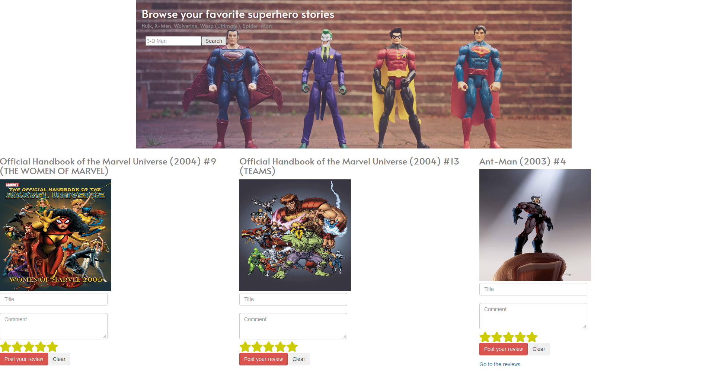

# Find Superhero Comics 
An app which allows the user to search, comment, and rate his favorite superheroes and comics. 

# Usage
* Click on https://developer.marvel.com/docs read the docs and register for the API keys.
* Copy *config.example.php* and insert your Marvel private and public key. 
* Create the database marveldata and copy the tables from migrations/sql/tables.sql in Sql workbench.
Run 
* http://localhost/ComicsFinder/web/index.php?c=&submit=Search in browser to search your favorite superhero stories

Code Source [https://github.com/chrimlino3/ComicsFinder]
